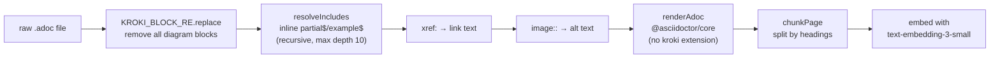

# Kroki & Diagrams Integration

Diagrams in the `nmecar` documentation set are **text-first**: authors write the diagram source (PlantUML, Mermaid, Graphviz, etc.) as AsciiDoc and commit it to version control, and a Kroki server renders it to an image at build time. This keeps diagrams diff-reviewable and editable alongside the prose, rather than committing opaque binary images. The same Kroki blocks are then deliberately stripped from the MCP ingest pipeline before embedding, because diagram source code is noise for semantic search. This page documents both ends of that lifecycle: the Antora/Kroki rendering path and the MCP `resolveMacros` stripping path.

## Two consumers, one concern

The repository has two independent consumers of the AsciiDoc corpus, and they treat diagram blocks oppositely:

- **Antora site build** (`antora-playbook.yml` → `asciidoctor-kroki`) — renders Kroki blocks into embedded images so the published HTML shows the diagram.
- **MCP docs server ingest** (`mcp-server/src/index.ts` → `resolveMacros`) — removes Kroki blocks entirely before rendering to plain text, because the textual diagram source degrades embedding quality.

Both share the same source files, but neither shares the other's configuration or runtime. The Antora build runs the `asciidoctor-kroki` extension with a network dependency on a Kroki server; the MCP ingest runs plain `@asciidoctor/core` with no Kroki extension and no network dependency.

## Antora rendering: the asciidoctor-kroki extension

Diagram rendering during the site build is provided by the `asciidoctor-kroki` extension (package `asciidoctor-kroki` `^0.18.1`), registered in the playbook's `asciidoc.extensions` list:

```yaml
# antora-playbook.yml
asciidoc:
  attributes:
    kroki-server-url: https://kroki.nmlabs.gr
  extensions:
    - 'asciidoctor-kroki'
    - '@asciidoctor/tabs'
```

The extension registers a block and a block macro for every diagram type it supports (`plantuml`, `mermaid`, `graphviz`, `ditaa`, `blockdiag`, `seqdiag`, `actdiag`, `nwdiag`, `packetdiag`, `rackdiag`, `c4plantuml`, `erd`, `excalidraw`, `nomnoml`, `pikchr`, `structurizr`, `svgbob`, `umlet`, `vega`, `vegalite`, `wavedrom`, plus more). An AsciiDoc block delimited by `....` (literal) or `----` (listing) with a `[plantuml]` / `[mermaid]` / `[graphviz]` / etc. attribute line is intercepted by the extension and turned into an image block.

Two document-level attributes drive where the render comes from:

- **`kroki-server-url`** (set in the playbook to `https://kroki.nmlabs.gr`) — the Kroki server that actually converts the diagram text to an image. `KrokiClient.getServerUrl()` reads this attribute and falls back to `https://kroki.io` when unset.
- **`kroki-fetch-diagram: true`** (set in the component descriptor `docs/antora.yml`) — when set, and the document safe mode is below `SECURE`, the extension *fetches the rendered image at build time* and writes it into the site's images output directory, so the generated HTML references a local file rather than calling the Kroki server on every page view.

<!-- openwiki: mermaid parse failed and this diagram was converted to a text fence so it does not break rendering. Fix the diagram source and restore the mermaid fence. Parser error: Heuristic: an unescaped angle bracket inside a label breaks rendering; rephrase the label. -->
```text
flowchart TD
  adoc["AsciiDoc page\n[plantuml]\n....\nsource\n...."]
  ext["asciidoctor-kroki extension\n(registered in playbook)"]
  fetch{"kroki-fetch-diagram: true\nand safe < SECURE?"}
  server["Kroki server\nhttps://kroki.nmlabs.gr"]
  save["fetch.js save()\nwrite image to imagesoutdir\nadd to Antora VFS"]
  uri["getDiagramUri()\nencode source → GET/POST URL"]
  local["local image reference\nin generated HTML"]
  remote["remote Kroki URL\nin generated HTML (view-time fetch)"]

  adoc --> ext
  ext --> fetch
  fetch -->|yes| save
  save --> server
  save --> local
  fetch -->|no| uri
  uri --> server
  uri --> remote
```

*How the asciidoctor-kroki extension decides between build-time fetch and view-time remote URLs, based on the `kroki-fetch-diagram` attribute.*

### Build-time fetch and its network dependency

Because `kroki-fetch-diagram: true` is active, a site build (`npx antora --fetch antora-playbook.yml`) contacts `https://kroki.nmlabs.gr` for every diagram it has not already cached on disk. `fetch.js save()` computes the diagram URL, hashes it (SHA-1 via `rusha`) to derive a filename like `diag-<hash>.svg`, and either reuses an existing file or calls `krokiClient.getImage()` to download the render from the Kroki server. The downloaded bytes are added to the Antora virtual filesystem and referenced as a local image in the generated HTML.

Two consequences follow:

- **Build-time network dependency.** A build with new or changed diagrams requires `kroki.nmlabs.gr` to be reachable; an unreachable server causes the extension to warn and skip the block (`Skipping <type> block.`), leaving the raw diagram source in a `kroki-error` block instead of an image. Already-fetched diagrams are cached on disk, so unchanged diagrams do not re-hit the server.
- **View-time independence.** Once fetched, the published HTML embeds local image files and does not call Kroki when a reader opens the page. This is the reason `kroki-fetch-diagram: true` is preferred over the default remote-URL behavior.

The Kroki client transport is `adaptive` by default: for short diagrams it encodes the source into a compressed GET URI (`{server}/{type}/{format}/{base64-deflate}`), and for URIs exceeding `kroki-max-uri-length` (default 4000) it falls back to a POST to `{server}/{type}/{format}` with the source in the body.

## Authoring diagrams

Diagram sources are textual and committed to version control — this is the project's explicit preference over static images. There are two accepted locations:

1. **Inline in a page** — write the diagram source directly in the `.adoc` page under `docs/modules/ROOT/pages/**` using a Kroki block:
   ```asciidoc
   [plantuml]
   ....
   @startuml
   A -> B
   @enduml
   ....
   ```
   either `....` (literal) or `----` (listing) delimiters are accepted.

2. **Standalone diagram files** — larger diagrams live as `.adoc` fragments under `specs/diagrams/`, each containing a `[plantuml]` block. The repository ships two:
   - `specs/diagrams/rental_activity_diagram.adoc` — a PlantUML activity diagram of the rental flow (search → select → availability → reserve → insurance/extras → payment).
   - `specs/diagrams/uml_class_diagram.adoc` — a PlantUML class diagram of the domain model (`Vehicle`, `VehicleGroup`, `Rental`, `Pricing`, `Location`, `Discount`, `Coupon`, etc.) with cardinality relationships.

Static images (screenshots, photos) are the exception, not the rule: they go in `docs/modules/ROOT/images/` and are referenced with `image::` macros, with alt text and captions for legibility.

### Diagram types and block syntax

The extension accepts the block form (inline source) and the macro form (source read from a file). For the block form, the attribute line names the diagram type and the delimiters carry the source:

```asciidoc
[mermaid]
----
graph TD
  A --> B
----
```

The macro form reads the source from a target file, useful for reusing a diagram kept in `specs/diagrams/`:

```asciidoc
plantuml::specs/diagrams/uml_class_diagram.adoc[]
```

When the extension processes a block, it applies any `subs` substitutions, optionally prepends a PlantUML `!include` file from the `kroki-plantuml-include` attribute, and renders. The default output format is `svg` (overridable per-block with `format=png` or via `kroki-default-format`); `txt`/`atxt`/`utxt` formats produce a literal text block instead of an image.

## MCP ingest: stripping Kroki blocks as embedding noise

The MCP docs server (`mcp-server/`) is the second consumer. At startup it ingests every `.adoc` page through `loadAdoc → resolveMacros → renderAdoc → chunkPage`, producing plain-text chunks that are embedded with OpenAI's `text-embedding-3-small`. Diagram source code — PlantUML `@startuml` bodies, Mermaid `graph TD` edges, Graphviz `digraph` definitions — is useless for semantic retrieval: it bloats chunks with syntax that does not answer natural-language questions. `resolveMacros` therefore removes every Kroki block **before** rendering.

The stripping is a single regex, `KROKI_BLOCK_RE`, applied as the first step of `resolveMacros`:

```ts
// mcp-server/src/ingest/resolveMacros.ts
const KROKI_BLOCK_RE =
  /\[\s*(?:plantuml|mermaid|graphviz|ditaa|blockdiag|seqdiag|actdiag|nwdiag|packetdiag|rackdiag|c4plantuml|erd|excalidraw|nomnoml|pikchr|structurizr|svgbob|umlet|vega|vegalite|wavedrom)[^\]]*\]\s*(?:\.{4}[\s\S]*?\.{4}|-{4}[\s\S]*?-{4})/gi;

// 1. Remove Kroki diagram blocks entirely (noise for embeddings)
src = src.replace(KROKI_BLOCK_RE, "");
```

The regex matches the attribute line (`[plantuml]`, `[mermaid]`, etc., allowing trailing attributes inside the brackets) followed by either `....`-delimited or `----`-delimited source, and deletes the whole block. The type list is broader than the diagram types the nmecar docs actually use (PlantUML today) so that any Kroki block type a future page introduces is also stripped. After stripping, the remaining text — prose, headings, tables, inlined partials and examples — is rendered to HTML by `@asciidoctor/core` (run **without** the `asciidoctor-kroki` extension, so any block the regex missed would simply pass through as a literal), then converted to plain text by `html-to-text`.

### Where stripping sits in the pipeline



*The MCP ingest preprocessing order: Kroki blocks are removed first, then includes are inlined, then xref/image macros are normalized, before rendering and chunking.*

Kroki removal is deliberately the **first** transformation. If includes were resolved first, a partial that itself contains a `[plantuml]` block would have its diagram source inlined and then stripped; doing Kroki removal before include resolution still works because the regex operates on the top-level text and the recursive `resolveIncludes` re-runs the same macro normalization on inlined partial content (though in practice no nmecar partial contains a diagram). The ordering is covered by the `resolveMacros.test.ts` suite, which asserts that both `....`-delimited PlantUML blocks and `----`-delimited Mermaid blocks are fully removed while surrounding prose survives.

## Configuration summary

| Setting | File | Effect |
|---|---|---|
| `kroki-server-url: https://kroki.nmlabs.gr` | `antora-playbook.yml` (playbook AsciiDoc attributes) | Kroki server used by the extension to render diagrams. |
| `kroki-fetch-diagram: true` | `docs/antora.yml` (component AsciiDoc attributes) | Fetch rendered images at build time; embed local files in HTML. |
| `asciidoctor-kroki` extension | `antora-playbook.yml` (`asciidoc.extensions`) | Registers the block/macro handlers for all Kroki diagram types. |
| `KROKI_BLOCK_RE` | `mcp-server/src/ingest/resolveMacros.ts` | Strips all Kroki block types (both delimiters) before MCP embedding. |
| `asciidoctor-kroki` NOT registered | `mcp-server/src/ingest/render.ts` | MCP render runs plain asciidoctor; diagram blocks are already gone and no Kroki network call is made during ingest. |

## Invariants and failure modes

- **Diagrams are textual and version-controlled.** Whether inline in a page or in `specs/diagrams/`, the diagram source is the artifact of record; the rendered image is a build product. Editing a diagram means editing its source, not re-exporting a binary.
- **`kroki-fetch-diagram: true` makes the build network-dependent on `kroki.nmlabs.gr`.** Unchanged diagrams are served from on-disk cache; new/changed diagrams require the server. If the server is unreachable, the extension logs `Skipping <type> block.` and emits the raw source in a `kroki-error` block rather than failing the build.
- **The MCP ingest never calls Kroki.** `resolveMacros` removes diagram blocks before `renderAdoc`, and `renderAdoc` does not register `asciidoctor-kroki`. Ingest therefore has no diagram-related network dependency; a diagram present in the corpus contributes nothing to the vector index.
- **The strip regex covers both delimiters and a broad type list.** Both `....` and `----` blocks are matched, and the type alternation is intentionally wider than the types currently in use, so adding a new diagram type to a page does not silently leak diagram source into embeddings.
- **Safe mode gates fetch.** `asciidoctor-kroki` only fetches (and only preprocesses PlantUML/Vega-Lite includes) when `doc.getSafe() < SAFE_MODE_SECURE` (20). The MCP render uses `safe: 'safe'` (below secure), but since it does not run the extension this gate is irrelevant to ingest; it only affects the Antora build path.
