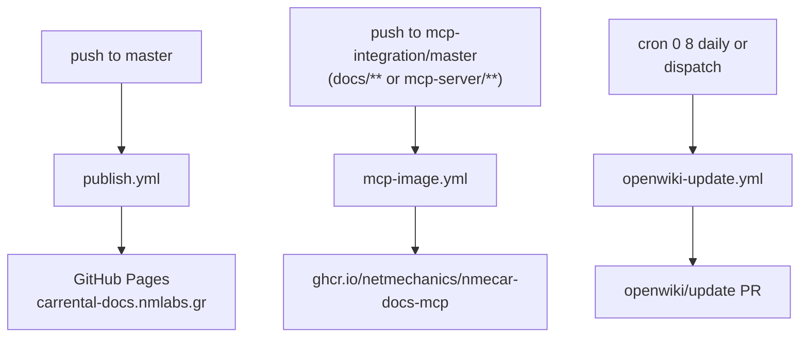

# CI/CD Pipelines

The repository is driven by three GitHub Actions workflows that together cover publishing, image delivery, and documentation refresh:

- **`publish.yml`** — builds the Antora documentation site and deploys it to GitHub Pages on every push to `master`.
- **`mcp-image.yml`** — runs the MCP server's typecheck and tests, then builds and pushes a Docker image to the GitHub Container Registry (GHCR) when `docs/**` or `mcp-server/**` change on `mcp-integration` or `master`.
- **`openwiki-update.yml`** — runs daily, regenerates the OpenWiki documentation via an LLM provider, and opens a pull request with the refreshed wiki content.



The three pipelines are independent: they trigger on different events, run on different runners, and write to different destinations (Pages, GHCR, and the repository itself via a PR).

## publish.yml — Documentation site deployment

**`publish.yml`** publishes the Antora documentation site to GitHub Pages. It is the only workflow that targets end-user-facing documentation output.

### Trigger and concurrency

The workflow runs on every push to `master` and is also available as a manual `workflow_dispatch`. A single concurrency group named `github-pages` serializes deployments; `cancel-in-progress: false` means a new run waits for the in-flight deployment to finish rather than cancelling it, so a deployment in progress is never interrupted mid-publish.

### Permissions and environment

The job requests the three permissions required for GitHub Pages deployments with the `GITHUB_TOKEN`:

- `contents: read` — to check out the repository.
- `pages: write` — to deploy to GitHub Pages.
- `id-token: write` — to mint the OIDC token used by `actions/deploy-pages`.

It targets the `github-pages` environment, whose `url` is sourced from the deployment step's `page_url` output. The job runs on a **self-hosted** runner.

### Build and deploy steps

The pipeline pins the Node toolchain to version 20 and uses `npm ci` for deterministic dependency installation (with the npm cache enabled). It builds the site with `npm run build:site`, writes a CNAME file (`carrental-docs.nmlabs.gr`) into `build/site`, uploads `build/site` as a Pages artifact, and finally invokes `actions/deploy-pages@v4` to publish that artifact to GitHub Pages. The site URL is therefore `carrental-docs.nmlabs.gr`.

## mcp-image.yml — MCP server Docker image

**`mcp-image.yml`** builds and publishes the MCP server's Docker image. It gates the image on the MCP server's own typecheck and test suite, so a failing test prevents a new image from being pushed.

### Trigger and path filtering

The workflow triggers only on pushes to the `mcp-integration` and `master` branches **and only when the push touches `docs/**` or `mcp-server/**`**. A push that modifies other paths — for example the Antora theme or workflow files — does not trigger an image build, because the MCP image content is unchanged.

### Registry and permissions

The registry and image name are declared as workflow environment variables:

- `REGISTRY: ghcr.io`
- `IMAGE_NAME: ghcr.io/netmechanics/nmecar-docs-mcp`

The job runs on `ubuntu-latest` with `contents: read` and `packages: write`, the latter being required to push packages to GHCR. It logs in to GHCR with `docker/login-action@v3` using `${{ github.actor }}` and the auto-provided `GITHUB_TOKEN`.

### Quality gate before build

Before any Docker step, the workflow installs the MCP server's dependencies with `npm ci` (working directory `mcp-server`), runs `npm run typecheck`, and runs `npm test` (Vitest). These steps all execute in `mcp-server`, and a failure in any of them stops the job before the image is built — the published image therefore reflects code that has passed typecheck and tests. Node 22 is used, with the npm cache keyed on `mcp-server/package-lock.json`.

### Image tags and build context

Image tags are generated by `docker/metadata-action@v5`:

- `type=sha,prefix=` — a tag equal to the commit SHA (no prefix), giving a traceable, immutable tag per build.
- `type=raw,value=latest,enable={{is_default_branch}}` — the `latest` tag is applied **only on the default branch**. A build from a non-default branch gets the SHA tag but not `latest`, so `latest` always points at the default-branch image.

The image is built with `docker/build-push-action@v6` using `context: .` (the repository root) and `file: mcp-server/Dockerfile`, so the Dockerfile reads source from the repo root even though it lives under `mcp-server/`. `push: true` pushes immediately rather than loading the image into the runner's local Docker daemon.

<!-- openwiki: broken internal link [../mcp-deployment.md] file "../mcp-deployment.md" does not exist. Fix the href or restore the target, then delete this comment. -->
The resulting image is `ghcr.io/netmechanics/nmecar-docs-mcp`, addressed by both a commit-SHA tag and, on the default branch, `latest`. See the related [MCP deployment](../mcp-deployment.md) page for how this image is consumed.

## openwiki-update.yml — Scheduled OpenWiki refresh

**`openwiki-update.yml`** regenerates the OpenWiki documentation and opens a pull request with the changes. It is the workflow that keeps this wiki in sync with the source.

### Trigger

The workflow runs on a schedule — `cron: "0 8 * * *"` (daily at 08:00 UTC) — and can also be triggered manually via `workflow_dispatch`. It carries top-level `contents: write` and `pull-requests: write` permissions so the job can both commit changes and open a PR.

### Checkout strategy

The checkout uses `actions/checkout@v4` (pinned to a specific commit) with `fetch-depth: 0` — a full-history clone. A shallow clone is deliberately avoided because `openwiki code --update` diffs `HEAD` against the commit it last documented; a shallow clone hides that previous commit and the update would run against an empty change summary. Full history is therefore an operational requirement, not an optimization.

### Install and run

The workflow installs OpenWiki globally with `npm install --global openwiki@0.4.3`, pinning the OpenWiki version. It also installs `mermaid@11.16.0` and `jsdom@29.1.1` for high-fidelity Mermaid diagram validation; these are optional but present for this wiki, which contains Mermaid diagrams. It then runs:

```
openwiki code --update --print
```

### Provider and tracing configuration

The OpenWiki run is driven by environment variables wired to repository secrets:

- `OPENWIKI_PROVIDER: openrouter` — selects the OpenRouter LLM provider.
- `OPENROUTER_API_KEY` — authenticates against OpenRouter.
- `OPENWIKI_MODEL_ID: "z-ai/glm-5.2"` — the model used for documentation generation.
- `OPENWIKI_LANGSMITH_API_KEY` — authenticates the LangSmith connector's code-mode pull.
- `LANGSMITH_API_KEY`, `LANGCHAIN_PROJECT: openwiki`, `LANGCHAIN_TRACING_V2: "true"` — enable LangSmith tracing of this workflow's own OpenWiki run, under the `openwiki` project.

Additional LangSmith workspaces can be added by defining `OPENWIKI_LANGSMITH_API_KEY_2`, `_3`, … as repository secrets and env entries.

### Pull request creation

After the update runs, `peter-evans/create-pull-request@v7` (pinned to a specific commit) commits the changes and opens a PR. The `add-paths` filter restricts the commit to:

- `openwiki`
- `AGENTS.md`
- `CLAUDE.md`
- `.github/workflows/openwiki-update.yml`

Changes outside these paths are ignored, so the update PR stays scoped to documentation and its own workflow definition. The PR targets the branch `openwiki/update`, with commit message and title both set to `docs: update OpenWiki`. Because the action only creates or updates a PR when there are changes to commit, a run that produces no diffs opens no PR.

## Cross-cutting notes

- **Runner selection differs by purpose.** `publish.yml` runs on a self-hosted runner (for the Antora build); `mcp-image.yml` and `openwiki-update.yml` run on `ubuntu-latest`.
- **Node versions differ by workflow.** The docs build pins Node 20; the MCP image and OpenWiki workflows use Node 22.
- **Pinning posture.** `openwiki-update.yml` pins both the `checkout` and `setup-node` actions to specific commit SHAs and pins `openwiki@0.4.3`; `publish.yml` and `mcp-image.yml` track the actions' `@v*` major-version tags.
- **Secrets.** The MCP image workflow needs only the auto-provided `GITHUB_TOKEN`. The OpenWiki workflow additionally requires `OPENROUTER_API_KEY`, `OPENWIKI_LANGSMITH_API_KEY`, and optionally `LANGSMITH_API_KEY` as repository secrets.
