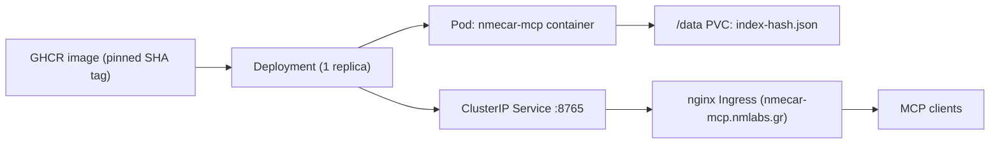

# MCP Server Deployment (Docker & Kubernetes)

The MCP server is a stateless Node service that exposes semantic-search MCP tools over Streamable HTTP. It is packaged as a Docker image built from the repo root and deployed to Kubernetes as a single replica behind an nginx Ingress. This page covers the image, the baked content, the `/data` vector cache, the environment split between baked and injected secrets, and the k8s manifests.

## Image: two-stage Dockerfile

`mcp-server/Dockerfile` is a multi-stage build. The build context is the **repository root**, not `mcp-server/`, because the runtime stage copies the Antora AsciiDoc corpus from `docs/modules/ROOT/`. The first line of the file records this contract:

```dockerfile
# Build context: repo root  (docker build -f mcp-server/Dockerfile .)
```

**Builder stage** (`node:22-slim AS builder`):

1. `COPY mcp-server/package*.json ./` then `npm ci` — installs full deps (including dev) from the lockfile.
2. `COPY mcp-server/tsconfig.json ./` and `COPY mcp-server/src/ ./src/`.
3. `RUN npm run build` — runs `tsc -p tsconfig.json`, emitting `dist/`.

**Runtime stage** (`node:22-slim AS runtime`):

1. `ENV NODE_ENV=production`.
2. `COPY mcp-server/package*.json ./` then `RUN npm ci --omit=dev` — production deps only.
3. `COPY --from=builder /app/dist ./dist` — compiled JS only.
4. Baked read-only content is copied into the image so the container needs no mounted docs volume:
   - `docs/modules/ROOT/pages   ./docs/pages`
   - `docs/modules/ROOT/examples ./docs/examples`
   - `docs/modules/ROOT/partials ./docs/partials`
5. The path/config env is **baked** here (these never need to change between environments):
   ```dockerfile
   ENV DOCS_ROOT=/app/docs/pages \
       PARTIALS_ROOT=/app/docs/partials \
       EXAMPLES_ROOT=/app/docs/examples \
       DATA_DIR=/data \
       PORT=8765
   ```
6. `VOLUME ["/data"]`, `EXPOSE 8765`, an in-image `HEALTHCHECK` that does `fetch('http://localhost:8765/health')` every 30s, and `CMD ["node", "dist/index.js"]`.

The `.dockerignore` keeps `node_modules`, `dist`, `data`, `.env`, and `*.log` out of the context.

### Build command and CI

Because the context is the repo root, the local build command is:

```bash
docker build -t nmecar-docs-mcp:latest -f mcp-server/Dockerfile .
```

CI (`/.github/workflows/mcp-image.yml`) builds and pushes the image on pushes to `mcp-integration` or `master` that touch `docs/**` or `mcp-server/**`. It runs `npm ci`, `npm run typecheck`, and `npm test` first, then uses `docker/build-push-action` with `context: .` and `file: mcp-server/Dockerfile`. Tags are `type=sha,prefix=` (the commit SHA) plus `latest` on the default branch, and the image is pushed to `ghcr.io/netmechanics/nmecar-docs-mcp`. The k8s Deployment pins a specific SHA tag (`ghcr.io/netmechanics/nmecar-docs-mcp:8a04778`), so rollouts are explicit and reproducible.

## Deployment topology



The container pulls the pinned image from GHCR (using an image-pull Secret), writes its embeddings cache to a mounted `/data` volume, is reachable inside the cluster via the ClusterIP Service, and is exposed externally through the nginx Ingress on `nmecar-mcp.nmlabs.gr`.

## Environment: baked vs injected

Two categories of configuration are split deliberately.

**Baked in the Dockerfile** (image-internal, identical for every environment): `DOCS_ROOT`, `PARTIALS_ROOT`, `EXAMPLES_ROOT`, `DATA_DIR=/data`, `PORT=8765`. `src/config.ts` reads these via a zod schema with defaults — `DATA_DIR` defaults to `/data`, `PORT` to `8765` — so the baked values match the schema defaults.

**Injected at runtime via Kubernetes** (per-environment secrets/config): `OPENAI_API_KEY`, `MCP_AUTH_TOKEN`, plus `OPENAI_EMBED_MODEL`, `EMBEDDING_PROVIDER`, `ALLOWED_ORIGINS`, `LOG_LEVEL`. The Deployment mounts these with `envFrom` referencing the `nmecar-mcp-config` ConfigMap:

```yaml
envFrom:
  - configMapRef:
      name: nmecar-mcp-config
```

The ConfigMap (`mcp-server/k8s/02_secret.yaml.example`) holds:

```yaml
data:
  OPENAI_API_KEY: "<OPENAI_API_KEY>"
  OPENAI_EMBED_MODEL: "text-embedding-3-small"
  EMBEDDING_PROVIDER: "openai"
  MCP_AUTH_TOKEN: "<MCP_AUTH_TOKEN>"
  ALLOWED_ORIGINS: "*"
  LOG_LEVEL: "info"
```

Note the file name: `02_secret.yaml.example` ships a `Secret` for GHCR image pulls and the runtime ConfigMap, with placeholder values meant to be filled in. `src/config.ts` enforces that `OPENAI_API_KEY` is required when `EMBEDDING_PROVIDER=openai` (and `GEMINI_API_KEY` when `gemini`), exiting non-zero on startup if missing. `MCP_AUTH_TOKEN` is optional to the config schema but required in production: when set, the HTTP transport's `authMiddleware` rejects `/mcp` requests whose `Authorization: Bearer <token>` header does not match; when unset, the endpoint is open.

The same secret file declares `ghcr-pull-secret`, a `kubernetes.io/dockerconfigjson` Secret in the `nmecar-mcp` namespace that authenticates pulls from `ghcr.io`.

## /data volume and the embeddings cache

The `/data` volume persists the precomputed vector index so the embeddings API is only called on the first boot (or when content changes).

At startup `src/index.ts`:

1. Loads `.adoc` files from `DOCS_ROOT`, resolves partials/examples, renders, and chunks them.
2. Computes a content hash via `contentHash()` in `src/indexing/hash.ts` — a SHA-256 over the sorted chunk texts, a `PIPELINE_VERSION`, and the embedder model name. This means the cache key changes whenever the content, the pipeline version, or the embedding model changes.
3. Calls `VectorStore.loadFromDisk(config.DATA_DIR, hash)`, which reads `/data/index-<hash>.json`.
4. On a **cache hit** the store is hydrated from disk and the embeddings API is never called ("Cache hit — loaded index from disk").
5. On a **cache miss** it builds the index (calling the embeddings API in batches with retry/backoff), then `saveToDisk` writes `/data/index-<hash>.json`.

Because the file is named with the hash, stale indexes for old content simply do not match and are ignored; a new hash produces a new file. `loadFromDisk` also verifies the stored `hash` field equals the expected hash before using the file. The Dockerfile declares `VOLUME ["/data"]` so a standalone `docker run` without a bind mount gets an anonymous volume; in Kubernetes the Deployment relies on a persistent volume attached at `/data` to survive pod restarts, so the second boot loads the cache without re-calling the embeddings API.

## HTTP transport and health

The Express app built by `createHttpApp()` in `src/mcp/httpTransport.ts` exposes:

- `GET /health` → `{ status: "ok" }`, used by Docker and Kubernetes probes. It runs before auth.
- `ALL /mcp` → the MCP Streamable HTTP endpoint, behind CORS and (when `MCP_AUTH_TOKEN` is set) Bearer auth. Each request constructs a fresh `McpServer` and a `StreamableHTTPServerTransport` with `sessionIdGenerator: undefined` — the stateless mode required by the streamable transport.

The in-image Docker `HEALTHCHECK` hits `http://localhost:8765/health` and exits 0/1 on the response status.

## Kubernetes manifests

All manifests target the `nmecar-mcp` namespace declared in `mcp-server/k8s/01_namespace.yaml`. They are numbered for ordered apply: `01_namespace`, `02_secret` (GHCR pull secret + ConfigMap), `03_deployment`, `04_services`, `05_ingress`.

### Deployment

`mcp-server/k8s/03_deployment.yaml` runs **1 replica**, pulls the SHA-pinned image via `ghcr-pull-secret`, injects env from `nmecar-mcp-config`, exposes port 8765, and defines probes and resource limits:

```yaml
spec:
  replicas: 1
  template:
    spec:
      imagePullSecrets:
        - name: ghcr-pull-secret
      containers:
        - name: nmecar-mcp
          image: ghcr.io/netmechanics/nmecar-docs-mcp:8a04778
          envFrom:
            - configMapRef:
                name: nmecar-mcp-config
          ports:
            - containerPort: 8765
              name: web8765
          readinessProbe:
            httpGet: { path: /health, port: 8765 }
            initialDelaySeconds: 15
            periodSeconds: 10
            failureThreshold: 3
          livenessProbe:
            httpGet: { path: /health, port: 8765 }
            initialDelaySeconds: 30
            periodSeconds: 30
            failureThreshold: 3
          resources:
            requests: { memory: "256Mi", cpu: "100m" }
            limits:   { memory: "512Mi", cpu: "500m" }
```

Both readiness and liveness hit `/health` on port 8765. Readiness starts at 15s with a 10s period; liveness starts later at 30s with a 30s period. Requests are 256Mi memory / 100m CPU; limits are 512Mi / 500m.

### Service and Ingress

`mcp-server/k8s/04_services.yaml` defines a `ClusterIP` Service `nmecar-mcp-service` selecting `app: nmecar-mcp`, forwarding port 8765 (named `web8765`) to the container's `web8765` target port.

`mcp-server/k8s/05_ingress.yaml` defines an nginx Ingress (`ingressClassName: nginx`) for host `nmecar-mcp.nmlabs.gr`, prefix `/`, backed by the `nmecar-mcp-service` named port `web8765`. It raises the nginx connect/read/send timeouts to 120s, which accommodates the longer-lived embedding-protected MCP requests.

## Operational notes

- **Reproducibility**: the Deployment image tag is a SHA, not `latest`. To roll forward you update the tag in `03_deployment.yaml`; CI only produces new SHA tags.
- **Cache lifecycle**: deleting `/data/index-<hash>.json` (or changing content/model) forces a rebuild and a paid embeddings call on next boot. Preserve the `/data` PVC across pod restarts to keep warm starts free.
- **Secrets**: the example ConfigMap holds real secret-shaped values (`OPENAI_API_KEY`, `MCP_AUTH_TOKEN`) as placeholders. Treat the file as a template; do not commit populated secrets.
- **Auth**: with `MCP_AUTH_TOKEN` injected, clients must send `Authorization: Bearer <token>` to `/mcp`; without it the endpoint is open (`/health` is always open).
