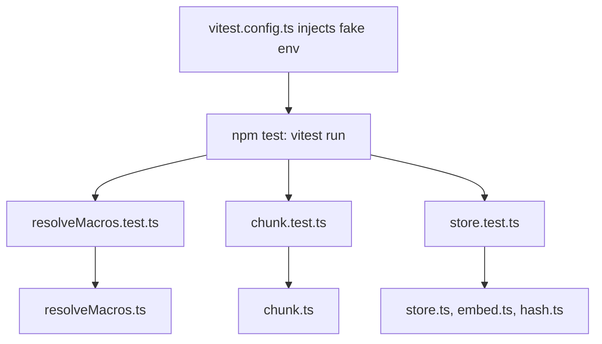
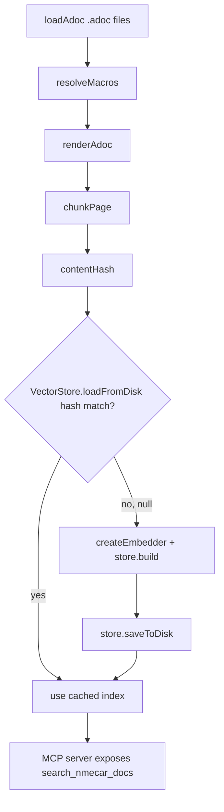

# MCP Server Testing

The `mcp-server` package ships three complementary verification layers:

1. **vitest unit tests** (`npm test`) — deterministic, no API key required, exercise the pure ingest and indexing logic in isolation.
2. **A live smoke script** (`npm run smoke`) — hits a running server over MCP and measures semantic-retrieval quality against ten Greek queries.
3. **A manual flow** documented in `mcp-server/TESTING.md` — environment setup, server startup, MCP Inspector, and curl checks.

A fourth tool, `npm run ingest:dump`, is not a test but a manual inspection aid that writes the extracted text and chunk summaries to disk so a human can eyeball what the pipeline produced for a failing page.

## Test surface at a glance

The unit-test suite is split across three files in `mcp-server/test/`, run by Vitest with a config that injects safe fake values for every required environment variable so the tests never need a real OpenAI key.



The vitest config injects `DOCS_ROOT`, `PARTIALS_ROOT`, `EXAMPLES_ROOT`, `DATA_DIR`, `OPENAI_API_KEY`, and `MCP_AUTH_TOKEN` so importing `src/config.ts` and `src/index.ts` does not crash the test process.

## Vitest environment and configuration

`mcp-server/vitest.config.ts` sets the test `env` object with placeholder paths under `/tmp` and a fake `OPENAI_API_KEY=sk-test` and `MCP_AUTH_TOKEN=test`. This matters because `src/config.ts` is imported transitively by the modules under test and its Zod schema hard-requires several non-empty path fields plus `MCP_AUTH_TOKEN`; without these env values the import would fail before any assertion runs. The fake key is never actually used because the store test supplies its own embedder and the real OpenAI client is only constructed inside `createEmbedder()`, which the unit tests never call.

## Unit test: resolveMacros

`mcp-server/test/resolveMacros.test.ts` exercises `src/ingest/resolveMacros.ts`, the first stage of the ingest pipeline that strips AsciiDoc macros before rendering. Each `it` block builds a temp directory tree with `partials/` and `examples/` subfolders in `beforeEach` and tears it down in `afterEach`, so the include-resolution tests work against real files.

The assertions cover, for every macro the production resolver handles:

- **Kroki/diagram removal** — a `[plantuml]....` block (the `....` delimiter) and a `[mermaid]----` block (the `----` delimiter) are both stripped entirely, while the surrounding prose survives. This guards the `KROKI_BLOCK_RE` regex in `resolveMacros.ts`, which alternates between the two delimiters.
- **Partial includes** — `include::partial$caution.adoc[]` is inlined with the partial's file contents, replacing the macro line.
- **Nav-partial skipping** — `include::partial$nav_admin.adoc[]` is dropped because partials whose name starts with `nav_` are treated as navigation noise and removed rather than inlined.
- **Example includes** — `include::example$Rental.java[]` is inlined as the example file's contents, and the production code wraps it in a `[source]\n----\n…\n----\n` fence; the test confirms the body text appears and the macro disappears.
- **xref replacement** — `xref:booking/discounts.adoc[Εκπτώσεις]` is replaced with its link text `Εκπτώσεις`; an `xref:…[]` with empty link text is dropped entirely (no target path leaks into the embedding text).
- **image:: replacement** — `image::screenshot.png[Στιγμιότυπο οθόνης]` is replaced with its alt text, and an image with empty alt is dropped.
- **Recursive includes** — a partial that itself includes another partial is resolved transitively up to the `MAX_DEPTH = 10` limit.

## Unit test: chunk

`mcp-server/test/chunk.test.ts` exercises `src/ingest/chunk.ts`, the stage that splits a rendered page into `Chunk` objects. It uses a `makePage` helper returning a `RenderedPage` with a fixed `relPath` so the chunk-id and `relPath` assertions are meaningful.

Assertions:

- **Non-empty output** — any non-empty page yields at least one chunk.
- **Unique ids** — four paragraphs produce chunks with distinct ids (ids are `${relPath}#${slug}-${idx}`).
- **Title in context prefix** — the first chunk's text contains the page title, because `chunkPage` prepends `«${title}»` or `«${title} › ${heading}»` to every chunk.
- **Max-token guard** — no chunk's `tokensApprox` exceeds ~1100 even for a deliberately oversized page; the production code splits by paragraph when a section exceeds `MAX_TOKENS = 800`, and `tokensApprox` is `Math.ceil(text.length/4)`.
- **Token-consistency invariant** — `tokensApprox` equals `Math.ceil(text.length/4)` for every chunk, so the test pins the approximation formula.
- **relPath propagation** — every chunk's `relPath` matches the input page's `relPath`.

The test does not directly assert the `MIN_TOKENS = 80` merge behavior, but the max-token and consistency cases pin the bounds that the merge step relies on.

## Unit test: store (the fake embedder pattern)

`mcp-server/test/store.test.ts` is the most consequential test because it pins the entire `VectorStore` lifecycle without calling the OpenAI API. It uses a **fake embedder** that returns deterministic orthogonal unit vectors:

```ts
function fakeEmbedder(dim = 4): Embedder {
  return {
    model: "fake-model",
    dims: dim,
    async embed(texts: string[]): Promise<number[][]> {
      return texts.map((_, i) => {
        const v = new Array<number>(dim).fill(0);
        v[i % dim] = 1;
        return v;
      });
    },
  };
}
```

For `N` texts in a `dim`-dimensional space, text `i` maps to the unit vector with a single `1` in position `i % dim`. Because these vectors are mutually orthogonal and already unit-length, a query vector that is itself a basis vector will have dot-product `1` with exactly one stored vector and `0` with all others. That makes the top-k ordering fully predictable from the test's own inputs — no network call, no nondeterminism, and no `OPENAI_API_KEY` needed.

The five `it` blocks assert:

- **build + search top-1** — three chunks built with the 4-d fake embedder; querying `[1,0,0,0]` returns chunk `a` with `score ≈ 1`, confirming `VectorStore.build` normalizes embeddings and `search` ranks by cosine/dot-product.
- **ordered k-results** — five chunks in a 5-d space; querying the basis vector for chunk 2 returns exactly `k=3` results in descending score order.
- **save/load round-trip** — a store is serialized via `saveToDisk(tmpDir, hash)` into `index-${hash}.json`, reloaded with `VectorStore.loadFromDisk(tmpDir, hash)`, and the reloaded store serves the same top-1 result with the correct size.
- **hash-mismatch returns null** — loading with a different hash than the one written returns `null`, because `loadFromDisk` reads the cached `hash` field and short-circuits when it does not equal the expected hash. This is the cache-invalidation mechanism that lets the server recompute an index when the content hash or model changes.
- **missing cache file returns null** — loading a hash that was never written also returns `null` (the `catch` swallows the file-not-found error), so a first run or a deleted cache triggers a rebuild via the `loadFromDisk ?? rebuild` branch in `src/index.ts`.

Together these tests pin the `build → search → save → load` core and the hash-based cache contract that the production startup path in `src/index.ts` relies on: compute `contentHash(chunks, model)`, try `loadFromDisk`, and on `null` rebuild + persist.

## Live smoke script

`mcp-server/test/smoke.ts` is not a Vitest test. It is a standalone script (`npm run smoke`, wired in `package.json` as `node --env-file=.env --import tsx/esm test/smoke.ts`) that requires a server already listening on `PORT` (default `8765`) and the `MCP_AUTH_TOKEN` env var. It:

1. Pings `${BASE_URL}/health` and exits `1` if the server is down.
2. For each of ten Greek queries, posts a `tools/call` MCP request for `search_nmecar_docs` with `k=5`, parses the Streamable-HTTP SSE response (`data:` line), and checks whether the expected `.adoc` page appears at top-1 and within the top-3.
3. Prints a per-query PASS/FAIL and a summary with the acceptance thresholds **top-1 ≥ 6/10** and **top-3 ≥ 8/10**, exiting `0` only when both are met.

The ten queries and their expected pages are the same set documented in `TESTING.md` (discounts, coupons, overlapping seasons, last-threshold pricing, roles, bank-deposit payments, scheduled jobs, driver-age charges, Grafana log filtering, editable rental fields). Because it calls the real OpenAI embedding model through the running server, the smoke run is the quality gate the unit tests intentionally cannot be.

## Non-test inspection tool: `npm run ingest:dump`

`mcp-server/src/ingest/dump.ts` is a manual diagnostic, not a test. It runs the full ingest pipeline (`loadAdoc → resolveMacros → renderAdoc → chunkPage`) for every source file and writes, under `data/_dump/`, a `.txt` of the rendered text and a `.chunks.json` summary (`id`, `section`, `tokensApprox`, 200-char `textPreview`) per page. `TESTING.md`'s troubleshooting section points operators here when smoke queries fail: inspect the `.chunks.json` for the failing page, check whether chunks exceed ~600 tokens (tune `MAX_TOKENS` in `chunk.ts`), and enrich headings if the context prefix lacks keywords. Because the embedder needs a real key, this command runs with `--env-file=.env`.

## CI gating

The Docker image build in `.github/workflows/mcp-image.yml` runs on pushes to `mcp-integration` and `master` when `docs/**` or `mcp-server/**` change. After `npm ci`, it runs `npm run typecheck` (`tsc --noEmit`) and then `npm test` (`vitest run`) as gates before the image is built and pushed to GHCR. So the vitest suite and the type checker are the hard CI gate; the live smoke script is a developer-facing quality bar, not a CI step.

## Relationship to the pipeline



The unit tests map onto the boxed stages of the production pipeline: `resolveMacros.test.ts` covers `resolveMacros`, `chunk.test.ts` covers `chunkPage`, and `store.test.ts` covers the `build → loadFromDisk → search` index lifecycle. The smoke script covers the rightmost stage by calling the exposed `search_nmecar_docs` tool end-to-end against the real embedder.
