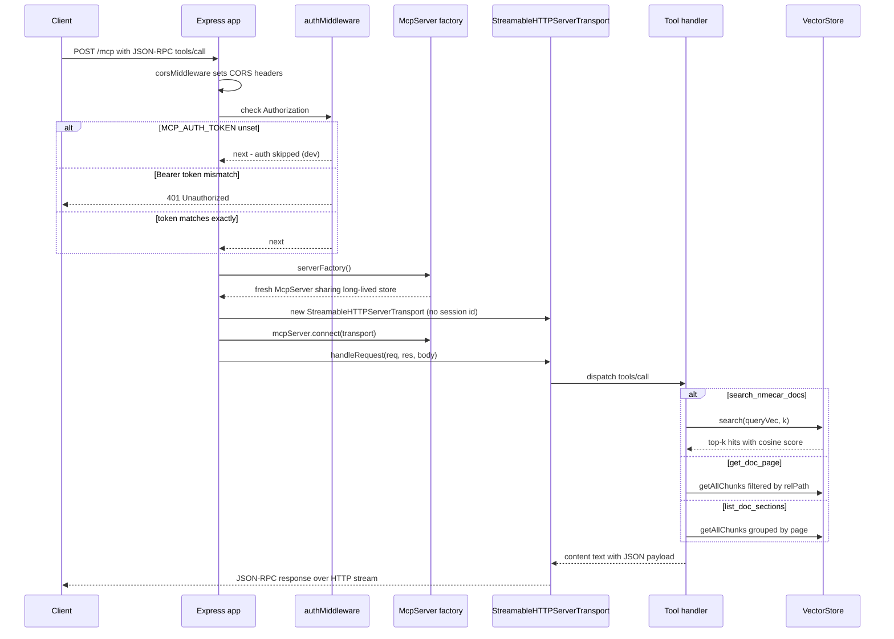

# MCP Request Handling Flow

This page traces what happens to a single MCP client request from the moment it
hits the Express HTTP application until a JSON-RPC response leaves the
`StreamableHTTPServerTransport`. The flow is implemented almost entirely in
`mcp-server/src/mcp/httpTransport.ts`, which assembles the Express app, and
`mcp-server/src/mcp/server.ts`, which registers the three tools dispatched on
each call. The long-lived `VectorStore` is built once at startup in
`mcp-server/src/index.ts` and shared across every request through a per-request
server factory.

## Endpoints

The Express app built by `createHttpApp(serverFactory)` exposes two routes on
top of a global CORS middleware and an `express.json()` body parser:

- `GET /health` — unconditional liveness/readiness probe returning
  `{ status: "ok" }`. It sits **before** the auth middleware and is not mounted
  under `/mcp`, so it never touches the MCP server or transport.
- `ALL /mcp` — the single MCP entrypoint. It applies `authMiddleware` and then,
  inside the handler, constructs a fresh `McpServer` and
  `StreamableHTTPServerTransport` per request.

## CORS middleware

`corsMiddleware` derives the allowed-origin list from `config.ALLOWED_ORIGINS`:

- When `ALLOWED_ORIGINS === "*"`, `allowedOrigins` is `null` and **every** request
  is echoed the `Access-Control-Allow-Origin` header (the request origin or `*`).
- Otherwise `allowedOrigins` is the comma-separated list and CORS headers are set
  only when the request `Origin` is in that list.
- `OPTIONS` preflight requests short-circuit with `204 No Content`.

## Auth middleware

`authMiddleware` gates only the `/mcp` route:

- If `config.MCP_AUTH_TOKEN` is unset, the middleware calls `next()` immediately
  and **auth is skipped**. This is the local-dev posture.
- Otherwise it reads the `Authorization` header, strips a `Bearer ` prefix, and
  requires the remaining token to match `config.MCP_AUTH_TOKEN` **exactly**. A
  mismatch responds `401 { error: "Unauthorized" }` and stops the chain.

`/health` is never authenticated, so probes can reach it without a token.

## Per-request server and transport

The `/mcp` handler is stateless by construction. For every request it:

1. Calls `serverFactory()` to obtain a **fresh** `McpServer` (the factory is
   `() => buildMcpServer(store, embedder)`, injected from `index.ts`).
2. Creates a `StreamableHTTPServerTransport` with
   `sessionIdGenerator: undefined` — i.e. no session ID, the Streamable HTTP
   stateless mode.
3. `await`s `mcpServer.connect(transport)`, then
   `transport.handleRequest(req, res, req.body)` to drive the JSON-RPC exchange
   and write the response.

A `try/catch` wraps `connect` and `handleRequest`; on failure it logs the error
and, only when `res.headersSent` is still false, responds
`500 { error: "Internal server error" }`.

## Startup: building the shared store

`index.ts` loads and chunks the AsciiDoc source, computes a content hash, and
either rehydrates a `VectorStore` from the on-disk cache
(`index-<hash>.json`) or builds it fresh by calling the embeddings API and
persisting it. That `store` (plus the `embedder`) is then handed to
`createHttpApp(() => buildMcpServer(store, embedder))`. The store is built
**once** and lives for the process; the factory only re-registers tools on each
request against the same in-memory vectors.

## Tool dispatch

`buildMcpServer(store, embedder)` registers three tools on the `McpServer`.
Each tool handler returns MCP `content` whose `text` is a `JSON.stringify`-ed
payload, so the shapes below are what a client sees after parsing that text.

### `search_nmecar_docs`

Input: `query` (string, min length 1) and optional `k` (int, 1–20, default 5).
The handler calls `searchDocs(store, embedder, query, k)`, which embeds the
query into a single vector and runs `store.search(queryVec, k)`. The returned
shape is:

```
{ results: [{ page, title, section, score, text }, ...] }
```

- `page` = `chunk.relPath`, `title` = `chunk.pageTitle`,
  `section` = `chunk.section`, `text` = `chunk.text`.
- `score` is rounded to three decimals via
  `Math.round(h.score * 1000) / 1000`.

`VectorStore.search` normalizes both the query vector and each stored vector and
scores by dot product (cosine similarity on unit vectors), sorts descending, and
returns the top `k` hits.

### `get_doc_page`

Input: `path` (the chunk's `relPath`, e.g. `booking/discounts.adoc`).
`getPage(store, pagePath)` filters all chunks whose `relPath` matches, **throws
`Page not found: <path>`** when none match, otherwise returns:

```
{ path, title, text }
```

`text` is all matching chunks' `text` joined with `\n\n---\n\n`, and `title`
comes from the first matching chunk. The tool handler catches the throw and
returns an MCP error result: `content` with the message as JSON and
`isError: true`, so a missing page surfaces as a tool-level error rather than an
HTTP 500.

### `list_doc_sections`

Input: none. `listSections(store)` groups every chunk by `relPath` into a `Map`
of `{ title, sections }`, pushing each distinct non-empty `section` once, and
returns:

```
{ pages: [{ path, title, sections }, ...] }
```

## Response transport

`StreamableHTTPServerTransport.handleRequest` writes the JSON-RPC response back
to the client over the HTTP response stream. The smoke harness in
`test/smoke.ts` posts a `tools/call` JSON-RPC body to `/mcp`, sends
`Accept: application/json, text/event-stream`, and parses either an SSE
`data:` line or a plain JSON body — confirming the transport may emit
`text/event-stream` framing.

## Health and probes

`/health` returns `{ status: "ok" }` and is the single probe target for both
runtime platforms:

- **Docker** `HEALTHCHECK` runs a `node -e fetch(...)` against
  `http://localhost:8765/health` and exits `0`/`1` on ok/not-ok.
- **Kubernetes** `readinessProbe` and `livenessProbe` both `httpGet` `/health`
  on port `8765`; the container image defaults `PORT=8765` and the Service
  exposes the same port.

Because `/health` bypasses auth and the MCP transport entirely, it reports
process liveness without depending on the embeddings store or a valid token.

## Request flow



The sequence above shows the per-request server/transport pair, the auth
decision branch, and the three tool paths all resolving against the same
long-lived `VectorStore`.

## Error handling summary

| Failure | Where handled | Result |
| --- | --- | --- |
| Bad/missing Bearer token (token configured) | `authMiddleware` | `401 { error: "Unauthorized" }` |
| Unhandled exception in `connect`/`handleRequest` | `/mcp` handler `try/catch` | `500 { error: "Internal server error" }` (only if headers not yet sent) |
| `get_doc_page` path not found | tool handler `catch` | MCP `isError: true` result with `{ error }` JSON; HTTP 200 |
| Embeddings API failure at startup | `index.ts` `main().catch` | process exit `1` (server never starts) |

Tool-level errors (e.g. a missing page) are translated into MCP error results
and never surface as HTTP 5xx, keeping the transport contract clean while the
`/mcp` handler still guards transport/connect failures with a 500.
