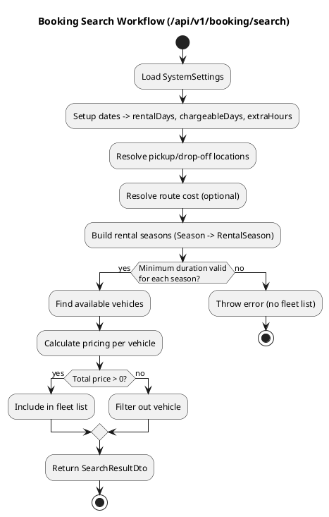
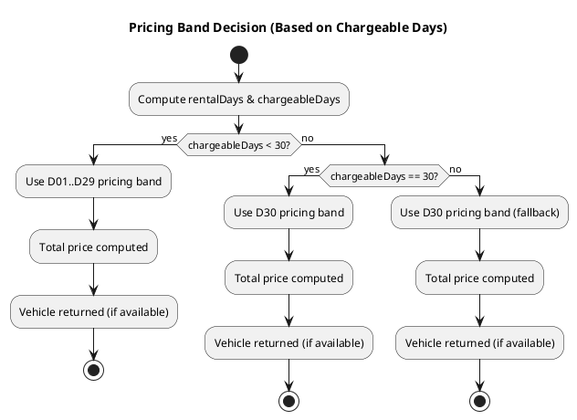
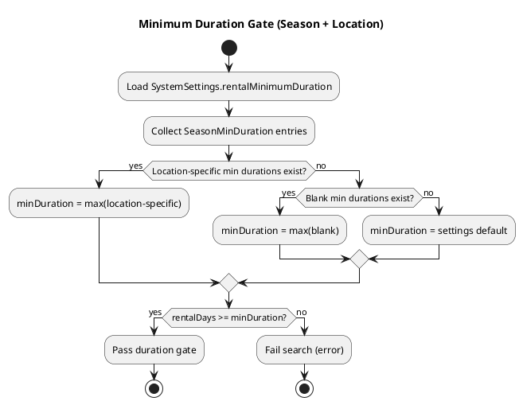
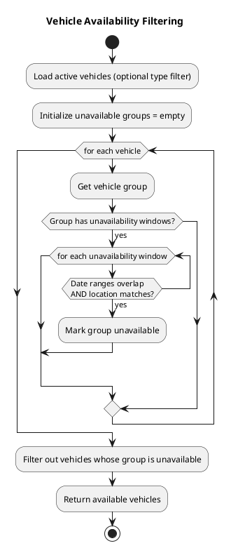
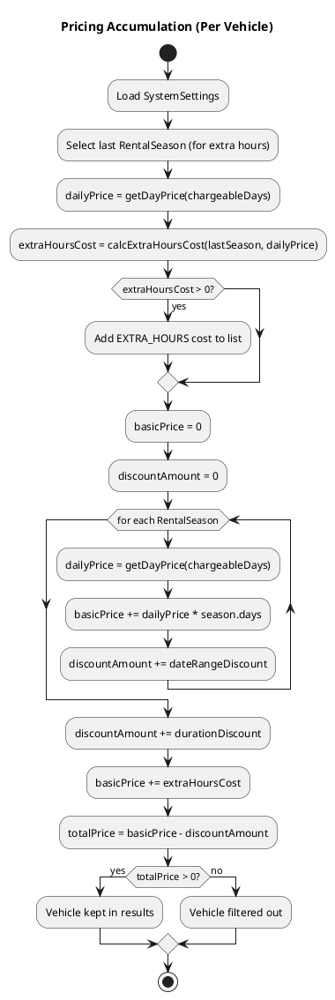
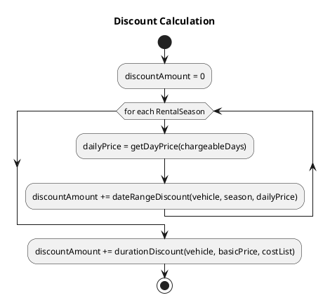
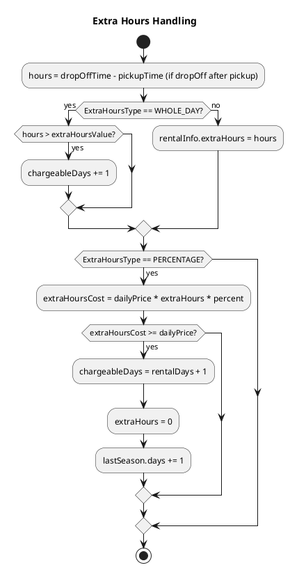

# Rental Logic (Search)

This document describes the current `/api/v1/booking/search` logic and how rental duration affects results. It is intended as a reference for future feature requests and changes.

## Scope
- Endpoint: `GET /api/v1/booking/search`
- Main flow: `SearchService.search()`
- Vehicle availability: `VehiclesSearchService.findVehicles()`
- Pricing: `VehiclesCostCalculatorService.calculateCosts()` and `GroupSeasonPricing.getDayPrice()`

## High-Level Workflow
1. Load system settings (`SystemSettings` via `AppSettings`).
2. Setup dates and compute rental duration (`rentalDays`, `chargeableDays`, `extraHours`).
3. Resolve pickup/drop-off locations and route cost.
4. Build rental seasons (`RentalSeason`) from all configured `Season` entities.
5. Validate minimum duration against each season.
6. Find available vehicles (status + unavailability windows).
7. Compute pricing for each vehicle.
8. Filter out vehicles whose total price is `<= 0`.

### PlantUML: Search Workflow

## Detailed Logic

### 1) Date and Duration
- `rentalDays` is computed as whole days between pickup and drop-off.
- If the time difference is `0` days, it is forced to `1` day.
- `chargeableDays` defaults to `rentalDays`, then may be adjusted by extra-hours rules.
- Extra hours are calculated when drop-off time is after pickup time.
  - If `ExtraHoursType = WHOLE_DAY` and extra hours exceed configured threshold, `chargeableDays` is incremented.
  - If `ExtraHoursType = PERCENTAGE`, extra hours remain as hours for price calculation.

### 2) Minimum Duration Validation
- The system enforces a **minimum rental duration** per season and optionally per location.
- The effective minimum is the maximum of:
  - Location-specific minimum durations for pickup/drop-off locations, or
  - General (blank) minimum duration.
- If `rentalDays < minDuration`, the search fails with an error (no fleet list).

### 3) Vehicle Availability
Vehicles are filtered by:
- Active vehicle status.
- Optional vehicle type filters.
- Group unavailability windows that overlap the requested date range and match locations.

### 4) Pricing
Pricing is based on seasonal day-band prices defined per vehicle group.

- For each vehicle, the system finds a matching `GroupSeasonPricing` for each season in the rental period.
- The daily price is computed with `getDayPrice(days)` where `days` is the **chargeable days**.
- `getDayPrice()` only supports bands `1` through `30` (D01..D30).
- If a day band is missing (returns `null`), pricing becomes `0` for that season and the final total price becomes `0`.
- Vehicles with `totalPrice <= 0` are removed from the search results.

### 5) Result Filtering
Only vehicles with a positive total price are returned in the `fleet.items` list.

## Duration Use Cases

### A) `rentalDays < 30`
Expected behavior:
- Pricing uses the matching day band (e.g., D05 for 5 days).
- Vehicles return normally (assuming they are available and minimum duration is satisfied).

Notes:
- If `rentalDays` is below the minimum duration for a season/location, the search fails with an error before pricing.

### B) `rentalDays = 30`
Expected behavior:
- Pricing uses band D30.
- Vehicles return normally (assuming they are available and minimum duration is satisfied).

### C) `rentalDays > 30`
Expected behavior with current logic (updated):
- `getDayPrice(days)` falls back to **D30** for any `days > 30`.
- Daily price uses D30, total price is computed normally, and vehicles are returned if available.

### PlantUML: Duration Decision

### PlantUML: Minimum Duration Gate

### PlantUML: Vehicle Availability Filtering

### PlantUML: Pricing Accumulation

### PlantUML: Discounts (Date Range vs Duration)

### PlantUML: Extra Hours Handling

## Examples (Using the Actual Rules)
These examples use concrete numbers but follow the **exact code paths and rules** used in production.

### 1) Simple Pricing (Single Season, D30 Fallback)
Rules used:
- `dailyPrice = getDayPrice(chargeableDays)` for each season.
- If `chargeableDays > 30`, `getDayPrice()` falls back to D30.
- `basicPrice = sum(dailyPrice * season.days)` across seasons.

Assume:
- Single season covers the entire rental.
- D05 = 80, D30 = 60.
- No discounts.

Examples:
- **5-day rental** → `chargeableDays = 5` → `dailyPrice = D05 = 80` → `basicPrice = 5 * 80 = 400`
- **30-day rental** → `chargeableDays = 30` → `dailyPrice = D30 = 60` → `basicPrice = 30 * 60 = 1800`
- **45-day rental** → `chargeableDays = 45` → `dailyPrice = D30 (fallback) = 60` → `basicPrice = 45 * 60 = 2700`

### 2) Extra Hours (WHOLE_DAY vs PERCENTAGE)
Rules used:
- If drop-off time is **after** pickup time:
  - `WHOLE_DAY`: if `hours > extraHoursValue`, then `chargeableDays = rentalDays + 1`.
  - `PERCENTAGE`: `extraHours = hours`, cost added later.
- In cost calculation (PERCENTAGE):
  - `extraHoursCost = dailyPrice * extraHours * percent`.
  - If `extraHoursCost >= dailyPrice`, then:
    - `chargeableDays = rentalDays + 1`, `extraHours = 0`, `lastSeason.days += 1`, `extraHoursCost = 0`.

Example A (WHOLE_DAY):
- Pickup: **2026-03-01 10:00**, drop-off: **2026-03-06 13:30**.
- `rentalDays = 5`, extra hours = 3.5.
- `ExtraHoursType = WHOLE_DAY`, `extraHoursValue = 2`.
- Since `3.5 > 2`, `chargeableDays = 6`.
- `dailyPrice` uses **D06**, and basic price uses 6 days.

Example B (PERCENTAGE):
- Pickup: **2026-03-01 10:00**, drop-off: **2026-03-06 16:00**.
- `rentalDays = 5`, extra hours = 6.
- `ExtraHoursType = PERCENTAGE`, `percent = 20%`, `dailyPrice = 60`.
- `extraHoursCost = 60 * 6 * 0.20 = 72`.
- Since `72 >= 60`, it converts to a full day:
  - `chargeableDays = 6`, `extraHours = 0`, `lastSeason.days += 1`, `extraHoursCost = 0`.

### 3) Minimum Duration Gate (Season + Location)
Rules used:
- Effective minimum is the **max** of:
  - Location-specific min durations (pickup or drop-off), or
  - Blank (general) min durations, or
  - System default (`SystemSettings.rentalMinimumDuration`).
- Entire rental duration (`rentalDays`) must satisfy this.

Assume:
- Pickup location min = 3 days, drop-off location min = 4 days.
- Blank min = 2 days.

Examples:
- **RentalDays = 3** → effective min = max(3, 4) = 4 → fails → search returns an error (no fleet list).
- **RentalDays = 5** → passes → search continues.

### 4) Discounts (Date-Range + Duration)
Rules used:
- **Date-range discount (per day)**:
  - For each day in `chargeableDays`, if the day overlaps the season and a date-range discount, apply the **highest** matching percentage for that day.
  - `dayDiscount = dailyPrice * percent`.
- **Duration discount (one-time)**:
  - Chooses the **highest** matching percentage:
    - First for the vehicle’s group, else global (no group).
  - Types: `EARLY_BOOKING` (months before booking) or `PER_RENTAL` (min/max duration + overlap).
  - `durationDiscount = basicPrice * percent`.

Assume:
- Today is **2026-02-18**.
- Rental: **2026-03-01 10:00 → 2026-03-11 10:00** (10 days).
- Single season covers all 10 days, `chargeableDays = 10`.
- D10 = 70.
- Date-range discount:
  - Active for **2026-03-03 → 2026-03-07**, 10% (highest for those days).
- Duration discount (PER_RENTAL):
  - Active, `minDuration = 7`, `maxDuration = 14`, percentage = 5%.

Calculation:
- `dailyPrice = 70`, `basicPrice = 10 * 70 = 700`.
- Date-range discount applies to **5 days** (Mar 3–7):
  - `discountDR = 5 * (70 * 0.10) = 35`.
- Duration discount applies once:
  - `discountPR = 700 * 0.05 = 35`.
- Total discount = 35 + 35 = 70.
- **Total price = 700 - 70 = 630**.

## Relevant Code References
- Duration and search flow: `src/main/java/gr/netmechanics/carrental/api/services/SearchService.java`
- Pricing and filters: `src/main/java/gr/netmechanics/carrental/api/services/VehiclesCostCalculatorService.java`
- Day-band pricing: `src/main/java/gr/netmechanics/carrental/entity/booking/GroupSeasonPricing.java`
